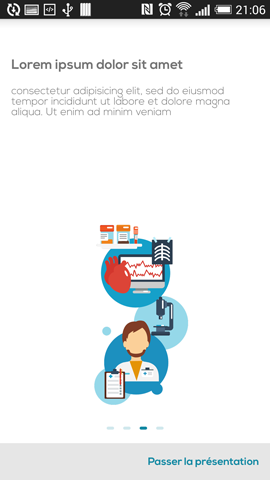
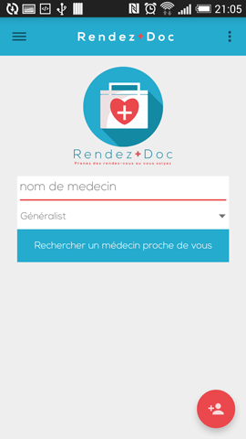
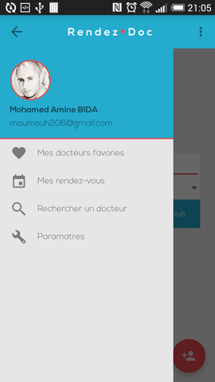

# Rendez-Doc
this app is for doctors , it helps users to get to the nearest doctors in town

Project created for autolearning where I try to apply the new **Material Design** and Android good practices to develop a **Doctors Annuaire (Rendez-Docs)** application using a mocked list of **doctors list** as the domain of the application.
 
Motivation
----
After I was givin the idea of making this app by one of my freinds , I liked it and we decided to make it,
We decided to make our own implenentation using this idea as reference.
 
Libraries used
----
- [FloatingActionButton](https://github.com/makovkastar/FloatingActionButton)
- [DSAvataImageView](https://github.com/xperi/DSAvataImageView)
- [Circleindicator](https://github.com/ongakuer/CircleIndicator)
- [MaterialDialog](https://github.com/drakeet/MaterialDialog)

Screenshots
----
 






Developed by
---
Mohamed Amine BIDA - <bida.mohamed@gmail.com>

* [LinkedIn](https://www.linkedin.com/in/moumouh206)
* [Twitter](https://twitter.com/moumouh206)

Thanks 
---
- Sem.C.D
- Aminatou


License
----
```
Copyright 2014 Mohamed Amine BIDA

Licensed under the Apache License, Version 2.0 (the "License");
you may not use this file except in compliance with the License.
You may obtain a copy of the License at

   http://www.apache.org/licenses/LICENSE-2.0

Unless required by applicable law or agreed to in writing, software
distributed under the License is distributed on an "AS IS" BASIS,
WITHOUT WARRANTIES OR CONDITIONS OF ANY KIND, either express or implied.
See the License for the specific language governing permissions and
limitations under the License.
```
